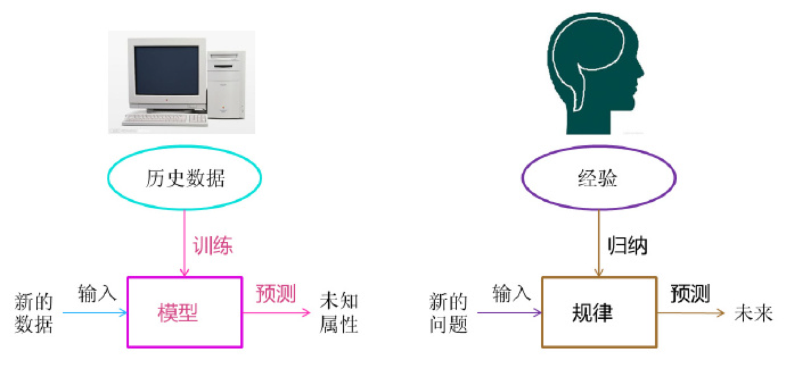
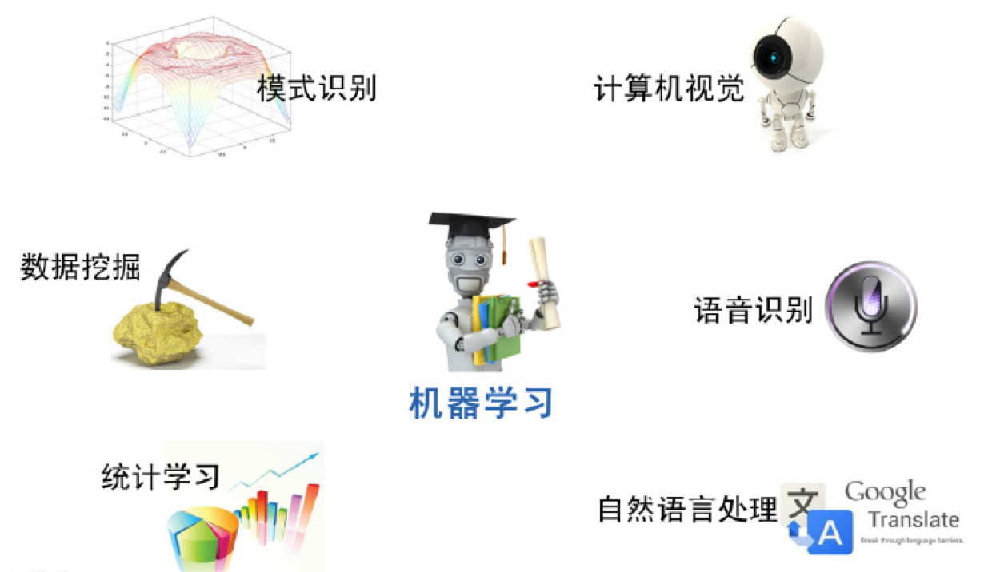
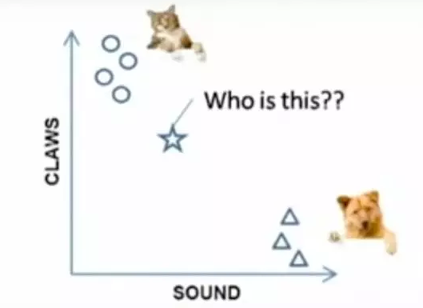
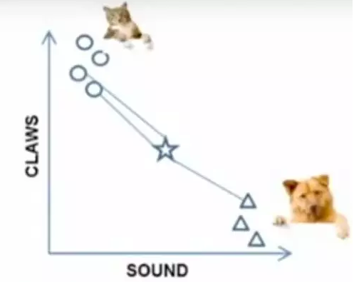
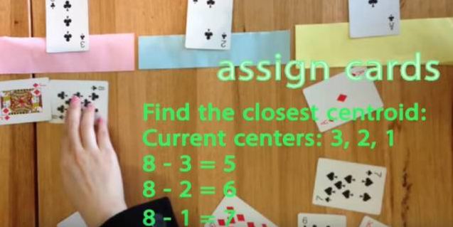
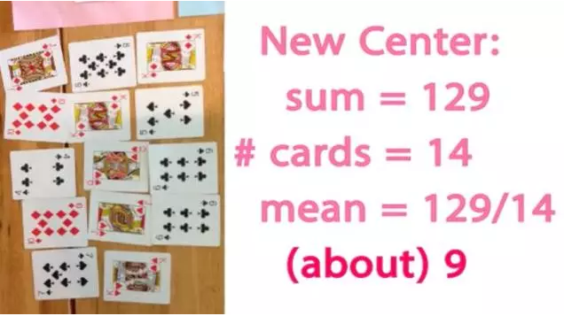
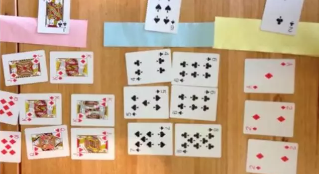
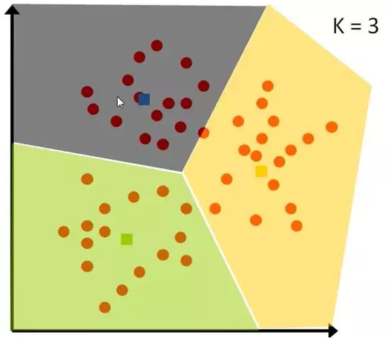

# 机器学习算法简单介绍

## 0. 引题

[在你上司靠近你座位时，用人脸识别技术及时屏幕切换](http://qingmang.me/articles/3612927888368008870)

## 1. 机器学习的综述

* 什么是机器？什么是计算机？
 * 时代背景(第二次世界大战  1946年第一台计算机诞生)
 * 设计的初衷(图灵机器 --> 计算原子弹的弹道 --> 日常使用的计算机) (军用 -> 民用)
 
* 计算机的目前使用情况？  
 * 数学计算/图形计算
 * 数据库存储(需要的时候可以进行查询和调用)
 * 计算机网络(网络通信)
 
 这些不乏包括计算机科学和其它科学分支进行结合的场景，但是计算机的最本质的情况还是计算;计算机之所以被日常广泛的运用，是因为它的计算机能力在日常生活中彰显无可替代的作用。

* 什么是知识？
 * 正式的回答：所谓知识，就它反映的内容而言，是客观事物的属性与联系的反映，是客观世界在人脑中的主观映象。就它的反映活动形式而言，有时表现为主体对事物的感性知觉或表象，属于感性知识，有时表现为关于事物的概念或规律，属于理性知识。
 * 个人认为：知识是从实践从总结出来规律。有时会出现假设和猜想先于实践而存在。(意识和物质的二元关系)

* 我们传统是如何让机器富有知识的？
 * 初期(人类赋予计算机知识 计算期)：基础算子(加/减/乘/除) / 将计算总结为公式，赋予给计算机
 * 中期(推理期 -> 知识期): 统计学习、符号类型表示/ 机器学习

* 机器学习的种类
 * 机械学习: 死记硬背式的学习;
 * 示教学习/类比学习: 从指令中学习/通过观察和发现学习;
 * 归纳学习: 从样例中学习(归纳学习，又可以分为有监督和无监督2种);
 
 

* 对于机器学习的理解：

 计算机凭借其强大的计算能力，从过往的样本数据中通过某些学习算子总结出一套富有某些规则的模型；用来评价或调查过往事件的某些规律，或用来预测未来的一些发生的事件。
 
 但是，值得注意的是，由“No Free Lunch”(没有免费的午餐)推导原理可知，脱离具体的问题，空泛的谈论"什么学习算法更好"是毫无意义的。 
 
 为什么机器学习1980-2000年都无太多人进行关注，而近年来为什么机器学习算法非常火热(应运而生)，主要是有3个原因的:
 1. 机器学习坚实的理论; (自身)
 2. 人类进入大数据时代，有太多堆积的数据，却无法处理; (外界)
 3. 计算机芯片和计算能力达到了一个前所未有的高度; (外界)

* 机器学习和其他领域的交叉：
 
  

## 2. 机器学习的理论基础

###2.1 真实的机器学习案例展示
   约会网站原始数据改进之后的样本数据

| id | 玩视频游戏所耗时间百分比|每年获得的飞行常客里程数| 美周消费的冰淇淋公升数 | 分类 | 
|---|----	| --------|--------|----------|
|1|40920	| 8.326976|0.953952|largeDoses|
|2|14488	|7.153469	|1.673904	|smallDoses|
|3|26052	|1.441871	|0.805124	|didntLike|
|4|75136	|13.147394|0.428964|didntLike|
|5|38344	|1.669788	|0.134296	|didntLike|
|6|72993	|10.141740|1.032955 |didntLike|
|7|35948	|6.830792	|1.213192	|largeDoses|
|8|42666	|13.276369|0.543880 |largeDoses|
|9|67497|8.631577|0.749278 |didntLike|

###2.2 机器学习研究基础:信息系统

决策信息系统  `IS=<U, A∪D, V, f>`

* U = {样本1,样本2,样本3,样本4,样本5,样本6,样本7,样本8,样本9}
* A = {'每年获得的飞行常客里程数','美周消费的冰淇淋公升数'}
* V = {{40920,14488, 26052,75136,38344,72993,35948,42666,67497},{...},{...}}
* f = {'每年获得的飞行常客里程数','美周消费的冰淇淋公升数') -> ('分类')}
* D = {'largeDoses','smallDoses','didntLike'}

###2.3 常见的机器学习算法

[轻松看懂机器学习十大常用算法](http://blog.jobbole.com/108395/)

国际权威的学术组织the IEEE International Conference on Data Mining (ICDM) 2006年12月评选出了数据挖掘领域的十大经典算法：

* k-nearest neighbor classification (KNN算法)
* The k-means algorithm (一种聚类算法)
* C4.5 (决策树是一个预测模型)
* SVM（Support Vector Machine 支持向量机）
* Apriori算法
* 最大期望(EM)算法
* PageRank(Google算法的重要内容)
* AdaBoost(迭代算法)
* 贝叶斯分类器
* 分类与回归树

## 3. 案例1: KNN分类算法(有监督)
k nearest neighbours

给一个新的数据时，离它最近的 k 个点中，哪个类别多，这个数据就属于哪一类

栗子：要区分 猫 和 狗，通过 claws 和 sound 两个feature来判断的话，圆形和三角形是已知分类的了，那么这个 star 代表的是哪一类呢

k＝3时，这三条线链接的点就是最近的三个点，那么圆形多一些，所以这个star就是属于猫

## 4. 案例2: K-Means算法(无监督)

* 想要将一组数据，分为三类，粉色数值大，黄色数值小
* 最开心先初始化，这里面选了最简单的 3，2，1 作为各类的初始值
* 剩下的数据里，每个都与三个初始值计算距离，然后归类到离它最近的初始值所在类别
 

* 分好类后，计算每一类的平均值，作为新一轮的中心点

* 几轮之后，分组不再变化了，就可以停止了

## 5. 思考
* 什么是属性？属性的处理和真实的情况有多少的关联？

  比如(黑色,红色,白色) 使用(#000000,#FF0000,#FFFFFF)即([0,0,0],[255,0,0],[255,255,255]) 和 使用(1，2，3)表示有什么区别。数据预处理过程。
  
* 什么是模型？经过处理后的模型是什么样的？
* 模型最后剩下什么？计算一个新的样例需要什么？
  
  * 模型自身体系。
  * 将测试集映射到模型空间的映射函数。

## 参考文献
[1] [在你上司靠近你座位时，用人脸识别技术及时屏幕切换](http://qingmang.me/articles/3612927888368008870)

[2] [轻松看懂机器学习十大常用算法](http://blog.jobbole.com/108395/)

[3] [演示项目的Git地址](https://github.com/dirtypy/python-train)

[4] [ windows+Mac下安装Python以及科学计算套装安装(scipy、numpy、matplotlib)](http://blog.csdn.net/kit_147/article/details/48211437)

[5] [Machine Learning in Action](https://www.manning.com/books/machine-learning-in-action)

[6] [机器学习. 周志华, 清华大学出版社.](https://book.douban.com/subject/26708119/)

[7] [有趣的机器学习：最简明入门指南](http://blog.jobbole.com/67616/)

[8] [从机器学习谈起](http://blog.jobbole.com/83400/)
