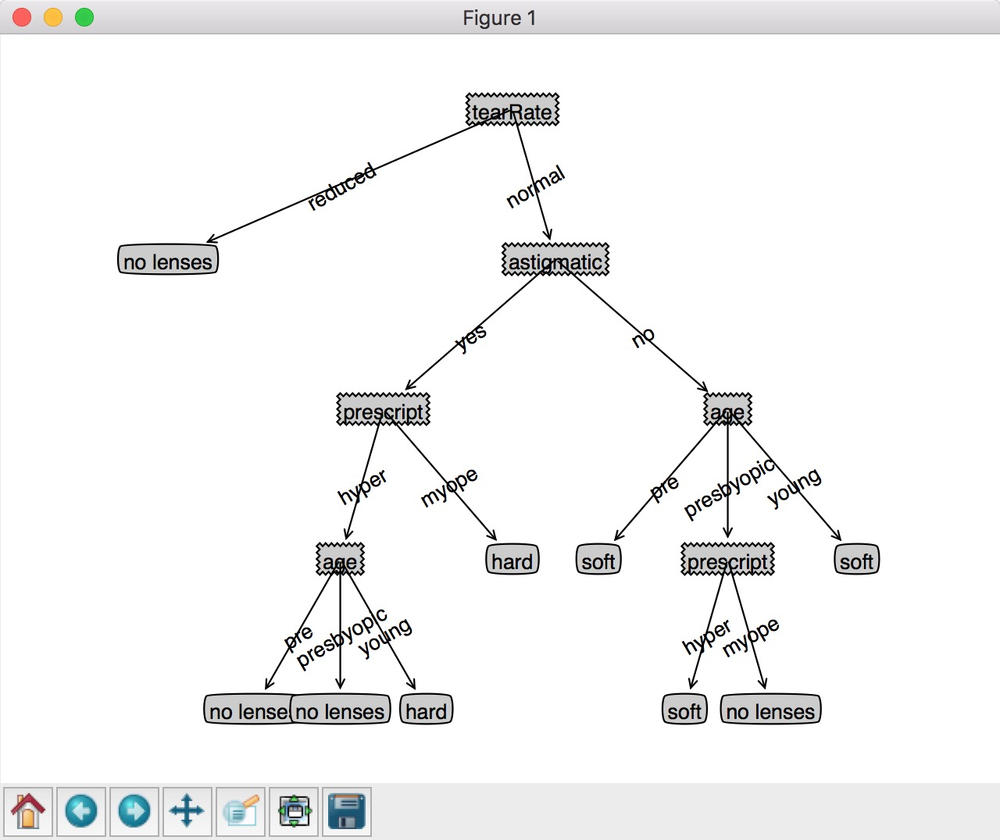

# 3. 决策树模型

本章 主要讲解了决策树模型，其中介绍了id3算法，同类的算法还有c4.5 、CAST算法等。
主要对应属性的属性值不是特别多的数据集。

熵的概念，判断属性的重要程度。

适应的数据集类型: 标称型数据(离散型数据)

抽象出的模型: 树形结构(文本结构/plot树状图结构)

文本: `{'no surfacing': {0: 'no', 1: {'flippers': {0: 'no', 1: 'yes'}}}}
`

plot树状图: 


## operator 1 获取香农熵值

```

python3
>>> import trees
>>> myData,labels=trees.createDataSet()
>>> trees.calcShannonEnt(myData)

```


## operator 2 划分数据集

```
 localhost:id3 Sean$ python3
 Python 3.6.0 (default, Dec 24 2016, 00:01:50) 
 [GCC 4.2.1 Compatible Apple LLVM 8.0.0 (clang-800.0.42.1)] on darwin
 Type "help", "copyright", "credits" or "license" for more information.
 >>> import trees 
 >>> myData,labels = trees.createDataSet()
 >>> trees.splitDataSet(myData,0,1)


```


## operator 3 利用香农熵作为判断条件 判断最重要属性

```

 localhost:id3 Sean$ python3
 Python 3.6.0 (default, Dec 24 2016, 00:01:50) 
 [GCC 4.2.1 Compatible Apple LLVM 8.0.0 (clang-800.0.42.1)] on darwin
 Type "help", "copyright", "credits" or "license" for more information.
 >>> import trees 
 >>> myData,labels = trees.createDataSet()
 >>> trees.chooseBeastFeatureToSplit(myData)
     0
 >>> myData
 [[1, 1, 'yes'], [1, 1, 'yes'], [1, 0, 'no'], [0, 1, 'no'], [0, 1, 'no']]

```

## operator 4 绘制一个树形结构（数据结构）

```

localhost:id3 Sean$ python3
Python 3.6.0 (default, Dec 24 2016, 00:01:50) 
[GCC 4.2.1 Compatible Apple LLVM 8.0.0 (clang-800.0.42.1)] on darwin
Type "help", "copyright", "credits" or "license" for more information.
>>> import trees
>>> myData,labels=trees.createDataSet()
>>> myTree = trees.createTree(myData,labels)
>>> myTree
{'no surfacing': {0: 'no', 1: {'flippers': {0: 'no', 1: 'yes'}}}}


```

## operator 5 使用plot 插件绘制决策树

对于plot绘制不是特别感兴趣，只是使用。具体实现略过。

```

localhost:id3 Sean$ python
Python 2.7.10 (default, Oct 23 2015, 19:19:21) 
[GCC 4.2.1 Compatible Apple LLVM 7.0.0 (clang-700.0.59.5)] on darwin
Type "help", "copyright", "credits" or "license" for more information.
>>> import treePlotter
>>> myTree = treePlotter.retrieveTree(0)
>>> treePlotter.createPlot(myTree)
/System/Library/Frameworks/Python.framework/Versions/2.7/Extras/lib/python/matplotlib/patches.py:3046: RuntimeWarning: invalid value encountered in double_scalars
  ddx = pad_projected * dx / cp_distance
/System/Library/Frameworks/Python.framework/Versions/2.7/Extras/lib/python/matplotlib/patches.py:3047: RuntimeWarning: invalid value encountered in double_scalars
  ddy = pad_projected * dy / cp_distance
/System/Library/Frameworks/Python.framework/Versions/2.7/Extras/lib/python/matplotlib/patches.py:3050: RuntimeWarning: invalid value encountered in double_scalars
  dx = dx / cp_distance * head_dist
/System/Library/Frameworks/Python.framework/Versions/2.7/Extras/lib/python/matplotlib/patches.py:3051: RuntimeWarning: invalid value encountered in double_scalars
  dy = dy / cp_distance * head_dist

```

## operator 6 根据决策树 决策测试样本类别

```

localhost:id3 Sean$ python
Python 2.7.10 (default, Oct 23 2015, 19:19:21) 
[GCC 4.2.1 Compatible Apple LLVM 7.0.0 (clang-700.0.59.5)] on darwin
Type "help", "copyright", "credits" or "license" for more information.
>>> import trees
>>> import treePlotter
>>> myData,labels=trees.createDataSet()
>>> myTree=treePlotter.retrieveTree(0)
>>> myTree
{'no surfacing': {0: 'no', 1: {'flippers': {0: 'no', 1: 'yes'}}}}
>>> trees.classify(myTree,labels,[0,1])
0
>>> trees.classify(myTree,labels,[1,1])
1

```

## operator 7 眼镜数据 (构建决策树模型)

```

localhost:id3 Sean$ python
Python 2.7.10 (default, Oct 23 2015, 19:19:21) 
[GCC 4.2.1 Compatible Apple LLVM 7.0.0 (clang-700.0.59.5)] on darwin
Type "help", "copyright", "credits" or "license" for more information.
>>> import trees
>>> import treePlotter
>>> fr=open('lenses.txt')
>>> lenses=[inst.strip().split('\t') for inst in fr.readlines()]
>>> lenses
[['young', 'myope', 'no', 'reduced', 'no lenses'], ['young', 'myope', 'no', 'normal', 'soft'], ['young', 'myope', 'yes', 'reduced', 'no lenses'], ['young', 'myope', 'yes', 'normal', 'hard'], ['young', 'hyper', 'no', 'reduced', 'no lenses'], ['young', 'hyper', 'no', 'normal', 'soft'], ['young', 'hyper', 'yes', 'reduced', 'no lenses'], ['young', 'hyper', 'yes', 'normal', 'hard'], ['pre', 'myope', 'no', 'reduced', 'no lenses'], ['pre', 'myope', 'no', 'normal', 'soft'], ['pre', 'myope', 'yes', 'reduced', 'no lenses'], ['pre', 'myope', 'yes', 'normal', 'hard'], ['pre', 'hyper', 'no', 'reduced', 'no lenses'], ['pre', 'hyper', 'no', 'normal', 'soft'], ['pre', 'hyper', 'yes', 'reduced', 'no lenses'], ['pre', 'hyper', 'yes', 'normal', 'no lenses'], ['presbyopic', 'myope', 'no', 'reduced', 'no lenses'], ['presbyopic', 'myope', 'no', 'normal', 'no lenses'], ['presbyopic', 'myope', 'yes', 'reduced', 'no lenses'], ['presbyopic', 'myope', 'yes', 'normal', 'hard'], ['presbyopic', 'hyper', 'no', 'reduced', 'no lenses'], ['presbyopic', 'hyper', 'no', 'normal', 'soft'], ['presbyopic', 'hyper', 'yes', 'reduced', 'no lenses'], ['presbyopic', 'hyper', 'yes', 'normal', 'no lenses']]
>>> lensesLabels=['age','prescript','astigmatic','tearRate']
>>> lensesLabels
['age', 'prescript', 'astigmatic', 'tearRate']
>>> lensesTree=trees.createTree(lenses,lensesLabels)
>>> lensesTree
{'tearRate': {'reduced': 'no lenses', 'normal': {'astigmatic': {'yes': {'prescript': {'hyper': {'age': {'pre': 'no lenses', 'presbyopic': 'no lenses', 'young': 'hard'}}, 'myope': 'hard'}}, 'no': {'age': {'pre': 'soft', 'presbyopic': {'prescript': {'hyper': 'soft', 'myope': 'no lenses'}}, 'young': 'soft'}}}}}}
>>> treePlotter.createPlot(lensesTree)
/System/Library/Frameworks/Python.framework/Versions/2.7/Extras/lib/python/matplotlib/patches.py:3046: RuntimeWarning: invalid value encountered in double_scalars
  ddx = pad_projected * dx / cp_distance
/System/Library/Frameworks/Python.framework/Versions/2.7/Extras/lib/python/matplotlib/patches.py:3047: RuntimeWarning: invalid value encountered in double_scalars
  ddy = pad_projected * dy / cp_distance
/System/Library/Frameworks/Python.framework/Versions/2.7/Extras/lib/python/matplotlib/patches.py:3050: RuntimeWarning: invalid value encountered in double_scalars
  dx = dx / cp_distance * head_dist
/System/Library/Frameworks/Python.framework/Versions/2.7/Extras/lib/python/matplotlib/patches.py:3051: RuntimeWarning: invalid value encountered in double_scalars
  dy = dy / cp_distance * head_dist
>>> aa


```